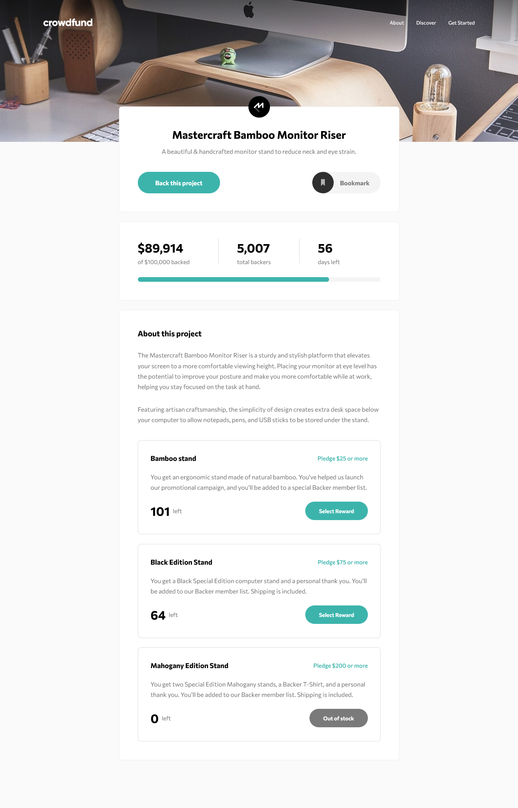

# frontendmentors - Crowdfunding product page

This is my solution of the [frontendmentors](https://www.frontendmentor.io) [Crowdfunding product page challenge](https://www.frontendmentor.io/challenges/crowdfunding-product-page-7uvcZe7ZR).

## Table of content

- [Overview](#overview)
  - [The challenge](#the-challenge)
  - [Screenshot](#screenshot)
  - [Links](#links)
- [My process](#my-process)
  - [Built with](#built-with)
  - [What I learned](#what-i-learned)
  - [Continued development](#continued-development)
  - [Useful resources](#useful-resources)
- [Author](#author)
- [Acknowledgments](#acknowledgments)

## Overview

### The challenge

Your challenge is to build out this crowdfunding product page and get it looking as close to the design as possible.

You can use any tools you like to help you complete the challenge. So if you have got something you'd like to practice, feel free to give it a go.

Your users should be able to:

- View the optimal layout depending on their device's screen size
- See hover states for interactive elements
- Make a selection of which pledge to make
- See an updated progress bar and total money raised based on their pledge total after confirming a pledge
- See the number of total backers increment by one after confirming a pledge
- Toggle whether or not the product is bookmarked

Want some support on the challenge? [Join our Slack community](https://www.frontendmentor.io/slack) and ask questions in the **#help** channel.

### Screenshot



### Links

The solution is live [here](https://lordseven777.github.io/frontendmentors-crowdfunding-agency/).

## My process

### Built with

The project is built using the following tools and technologies:

- HTML
- CSS
- BEM methodology: [Block Element Modifier is a methodology, that helps you to achieve reusable components and code sharing in the front-end](https://getbem.com/introduction/).
- Javascript (Vanilla)
- Redux ([A predictable state container for JavaScript apps](https://redux.js.org/))
- PostCSS ([A tool for transforming CSS with JavaScript](https://postcss.org/))
- Live Server ([Extension for Visual Studio Code - Launch a development local Server with live reload feature for static & dynamic pages](https://marketplace.visualstudio.com/items?itemName=ritwickdey.LiveServer))

### What I learned

Well, this project had me cover a wide range of new things for me. These are the highlight of the things that I learned:

- **CSS nesting** ([mdn](https://developer.mozilla.org/en-US/docs/Web/CSS/CSS_nesting)): It's actually the first time that I used the new nested CSS rules syntax. It's actually handy that we can write such syntax without the need of using SCSS. A minor drawback though is that selectors concatenation is not possible using this nested syntax which had to rewrite the full parent class names when I used the BEM methodology.  
  Here is a code snippet of this syntax:

```css
.pledge-card {
  border-radius: 0.5rem;
  border: 1px solid #dbdbdb;
  padding: 1.5rem;
  transform-origin: 0 0;

  .pledge-card__header,
  .pledge-card__footer {
    display: flex;
    flex-direction: column;
    align-items: flex-start;
  }

  /** More code ... */
}
```

- **Responsive & Accessible navigation bar**: TLDR; I wrote a custom vanilla Javascript function that handles the open/closed on state of a responsive navigation bar (navigation menu + toggle) and also its aria-attributes when the menu gets open/closed and when the screen resizes.

- **Conditional content using the ::after pseudo-selector**: The content of the bookmark button is defined as the ::after pseudo-element's content instead of written directly inside the HTML. Then, when the button is toggled, instead of manually updating the button's content via javascript, the content is made conditional based on whether the class name that marks the button as bookmarked is present or not.
  Here is a code snippet of what it looks like:

```css
.bookmark-btn {
  /** CSS rules ... */

  &::after {
    content: "Bookmark";
    /** Other rules ... */
  }

  &.bookmark-btn--marked &::after {
    content: "Bookmarked";
    /** Other rules ... */
  }
}
```

- **UI state management using Vanilla Javascript and Redux**: [Redux](https://redux.js.org/) is a Javascript library which serves as a solution for state management in Javascript applications. It is often used along with full-fledged Javascript frameworks such as [React.js](https://react.dev/). However, since I did not use such frameworks, all the UI updates had to be tediously done using Vanilla Javascript.  
  When using Redux, we need to deal with those 3 main elements: _**Store**_, _**Actions**_ and _**Reducer**_. The **store** is the central object that stores the state and enables differents actions in regards to the state. The **actions** are the different kinds of operations that we're allowed to dispatch the store in order to udpate the state according to the purpose of the operations. The **Reducer** is a function that tells the store how to update the state based to the action being dispatched. Once the store is created, we can then _subscribe_ to the store where we can sync the UI with the state's changes.  
  Here is a snippet of the initial state:

```js
const initialState = {
  isBookmarked: false,
  backedAmount: 89_914,
  backersCount: 5_007,
  selectedPledgeId: null,
  pledges: [
    {
      id: "no-reward",
      leftCount: 0,
      minAmount: 0,
    },
    {
      id: "bamboo-stand",
      leftCount: 101,
      minAmount: 25,
    },
    {
      id: "black-edition-stand",
      leftCount: 64,
      minAmount: 75,
    },
    {
      id: "mahogany-stand",
      leftCount: 0,
      minAmount: 200,
    },
  ],
  thereIsFeedback: false,
};
```

Here is a snapshot of the actions:

```js
export const BOOKMARK_TOGGLE = "BOOKMARK_TOGGLE";
export const PLEDGE_SELECTED = "PLEDGE_SELECTED";
export const PLEDGE_ENTERED = "PLEDGE_ENTERED";
export const FEEDBACK_CLOSED = "FEEDBACK_CLOSED";
```

Here is a snapshot of the reducer:

```js
function reducer(state = initialState, action) {
  switch (action.type) {
    case BOOKMARK_TOGGLE:
      return { ...state, isBookmarked: action.payload ?? !state.isBookmarked };

    case PLEDGE_SELECTED:
      return { ...state, selectedPledgeId: action.payload };

    case PLEDGE_ENTERED: {
      const { pledgeId, amount } = action.payload;
      const backedAmount = state.backedAmount + amount;
      const pledges = [...state.pledges];
      const i = pledges.findIndex((pledge) => pledge.id === pledgeId);
      const pledge = { ...state.pledges[i] };
      pledge.leftCount--;
      pledges[i] = pledge;
      return { ...state, backersCount: state.backersCount + 1, pledges, backedAmount, thereIsFeedback: true };
    }

    case FEEDBACK_CLOSED:
      return { ...state, thereIsFeedback: false };

    default:
      return state;
  }
}
```

Here is a snapshot of how to create the store:

```js
export const store = Redux.createStore(reducer);
```

Here is how we _**dispatch**_ the `BOOKMARK_TOGGLE` action to the store and _**subscribe**_ to the store to sync the button's properties with the `isBookmarked` state value:

```js
import { BOOKMARK_TOGGLE, store } from "./redux/store.js";

export function renderBookmarkButton() {
  const bookmarkBtn = document.getElementById("bookmark-btn");

  bookmarkBtn.addEventListener("click", () => {
    store.dispatch({
      type: BOOKMARK_TOGGLE,
    });
  });

  store.subscribe(() => {
    const state = store.getState();
    const modifierClass = "bookmark-btn--marked";
    if (state.isBookmarked) {
      bookmarkBtn.setAttribute("aria-label", "Remove from bookmarks");
      bookmarkBtn.classList.add(modifierClass);
    } else {
      bookmarkBtn.setAttribute("aria-label", "Bookmark");
      bookmarkBtn.classList.remove(modifierClass);
    }
  });
}
```

- **Modals using the native dialog element**: The [dialog](https://developer.mozilla.org/fr/docs/Web/HTML/Element/dialog) element is a fairly new HTML element that has a native role of `dialog` or `modal` depending on how you use it. For this project, the **dialog** element was used to create the modal for submitting the pledges and the modal for confirming the pledge. The dialog is marked as `modal` when it is open using the `.showModal()` method.

- **JSDocs comments**: ([See here](https://jsdoc.app/)) Since I did not use Typescript but still wanted some good code completion inside my VSCode editor, I managed to make use JSDocs comments almost everywhere in my codebase for better code documentation and code completion.

- **Counter animation**: The amount of backed money and the backers total count on the HTML are animated in a speed counter increment fashion starting from 0 to their initial values. I have actually reached out to ChatGPT to write the function that does this but from my understading of the code that it gave me, the animation mechanism relies on the native `requestAnimationFrame()` function as well as the equivalent current count of the counter proportioanl to the progress of the elapsed time in relation to the animation duration.  
  Here is a snapshot the counter function:

```js
/**
 * Sets up an animation counter
 *
 * @param {CounterAnimationArguments} args The arguments
 */
export function animateCounter(args) {
  const { startCount = 0, targetCount, duration, updateFn } = args;
  const startTime = performance.now();

  function updateCounter(currentTime) {
    const elapsedTime = currentTime - startTime;
    const progress = Math.min(elapsedTime / duration, 1);
    const currentCount = Math.floor(progress * (targetCount - startCount) + startCount);

    updateFn(currentCount);

    if (progress < 1) {
      requestAnimationFrame(updateCounter);
    }
  }

  requestAnimationFrame(updateCounter);
}
```

- **IntersectionObserver based animations**: Animations that get triggered when the element to animate becomes visible on the screen are a popular trend nowadays. However, there are many ways to achieve this behavior and many solutions already exist to fully extend this functionality but I wanted to keep things simple and minimalistic so I came up with my own custom vanilla JS function that is intended to animate elements only when these are visible on the screen using the `IntersectionObserver` API and some other extra helpers.

### Continued developement

Let's now talk address the things that are to improve in my subsequent projects from now on based on what I have achieved so far.

- _**Use of SCSS for better DX**_: PostCSS and CSS Nesting are not bad, still I think that [SCSS](https://sass-lang.com/) comes in very handy when using the BEM methodology since it enables selectors concatenation. Also, I can define my custom function can converts a `px` value to its `rem` value and that frees me from the pain of always having to manually calculate the `rem` values of the `px` values and having those `px` values written inside comments. This does not have to be the case for everyone but when having the write the CSS code "from scratch", the use SCSS suits best to my workflow.

- _**The code for the navigation bar animation is a little bit overcomplicated and not feature-complete**_: As for the open/closed animation of the navigation menu on small screens, I have realized that the round-trips `setTimeout()` and the intermediate class names during the animation phases are not that necessary and could have been done in a much simpler way. Also, when the navigation is open, I did not implement how to capture the focus only within the navigation menu yet.

- _**Counter animation with ease timing-function**_: The counter animation of the stats numbers progresses linearly in the current animation. For my next projects, I want to improve the animation to progress following an `ease` timing-function.

- _**Better animations**_: I have struggled with the animations of the pledges articles cards. First, I wanted to do a 3D rotation on the cards as they show but I could not achieve the desired behavior. I maybe should work more on the CSS 3D transformations and the other CSS properties that go along with it such as `perspective`. Now that I used a _**slide in**_ animation for the cards, I do not know why the cards did not show when I tried to slide them from the left using `translateX(-50%)` so I had them slide from the right and it worked. I should be aware of what caused this unexpected behavior.

- _**Better use of semantics and support for accessibility**_: There is still a long way to go for me in terms of having a good expertise on writing the right HTML semantics and applying the best accessibility best practices so I am sure there are a lot to improve to the HTML document but I always try to improve and learn new things as I go.

- _**Use of other state management solutions**_: Redux is good but I think that manually syncing the store with the UI without any full-fledge Javascript framework is little bit heavy using vanilla Javascript. In my opinion, libraries/frameworks such as [HTMX](https://htmx.org/) or [Alipne.js](https://alpinejs.dev/) could have simplified this process more.

- _**Vite as a code bundler**_: The Javascript code and modules that I wrote should be bundled into a single or a few minified Javascript bundles for the sake of performance by using code bundlers such as [Vite](https://vitejs.dev/).

### Useful resources

Here is list of useful resources that helped during this project:

- [aria-haspopup](https://developer.mozilla.org/en-US/docs/Web/Accessibility/ARIA/Attributes/aria-haspopup)
- [PostCSS](https://postcss.org/)
- [dialog element](https://developer.mozilla.org/fr/docs/Web/HTML/Element/dialog)
- [ARIA: progressbar role](https://developer.mozilla.org/en-US/docs/Web/Accessibility/ARIA/Roles/progressbar_role)
- [Redux](https://redux.js.org/)
- [BEM methodology](https://www.toptal.com/css/introduction-to-bem-methodology#:~:text=BEM%20stands%20for%20Block%20Element,that%20is%20BEM%20in%20action.)
- [CSS tutorial - W3Schools](https://www.w3schools.com/css/)

## Author

- Github: [@LordSeven777](https://github.com/LordSeven777)
- Instagram: [@amazing_tool](https://www.instagram.com/amazing_tool/)

## Acknowledgement

I have to say that even though this challenge was aimed at beginners, there was a wide range of topics to cover. In my opinion, the most tedious part of writing CSS is defining the various styles across different viewports to make the page's style responsive.  
There are couples of potentially overlooked UI twists in the UI that only few may notice:

- There is a subtle light shadow on top of the navigation bar.
- The description of the Mastercraft project is differs a little bit between the one for the mobile screen and the other one for the desktop screen.

That's it for me, I was glad to share my work and I would appreciate feedbacks from you guys. Happy Coding! 🤓

<!--  -->
